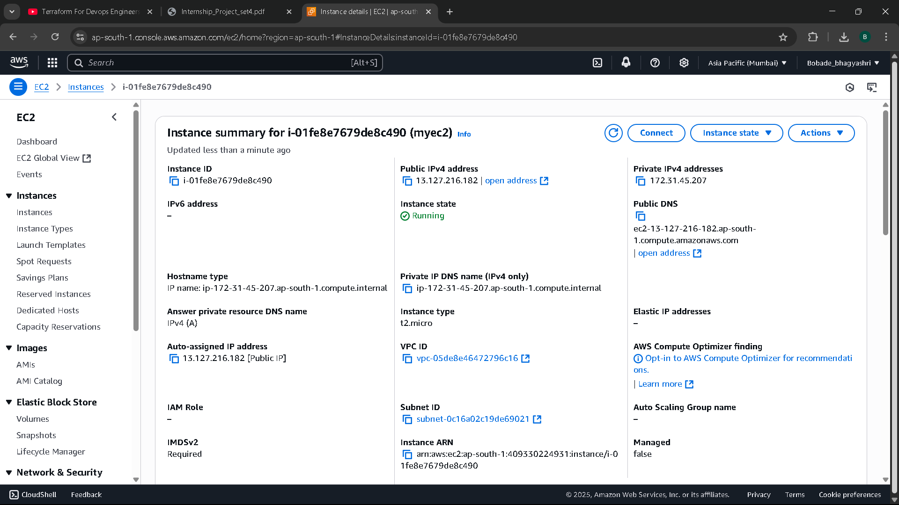
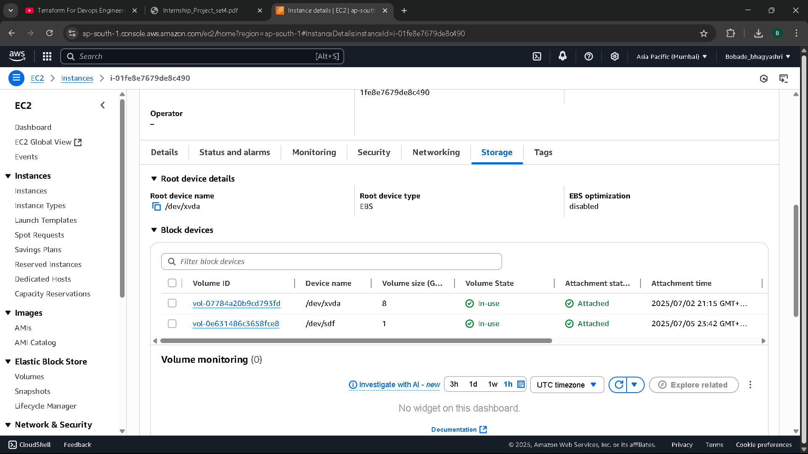
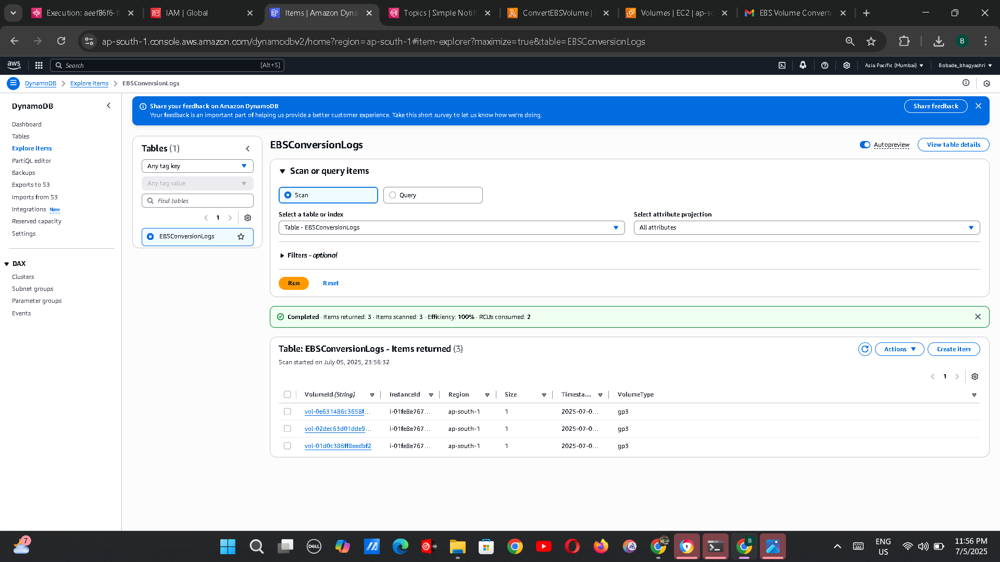
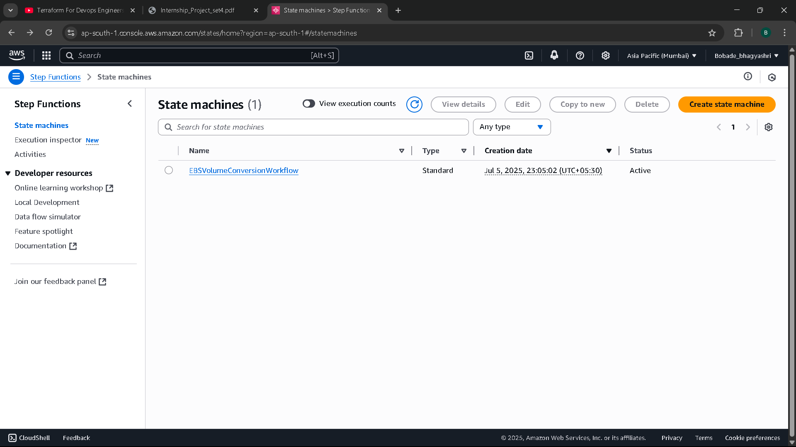
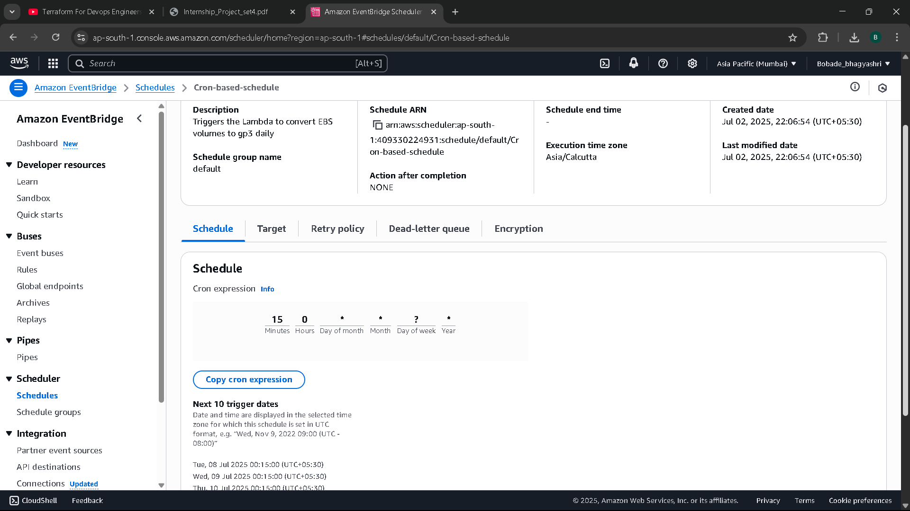
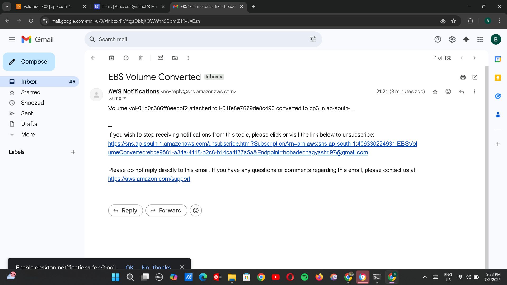
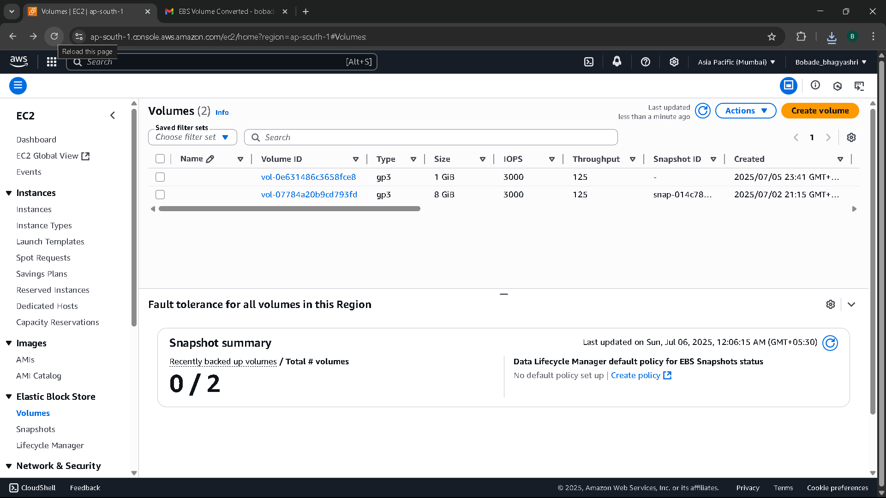
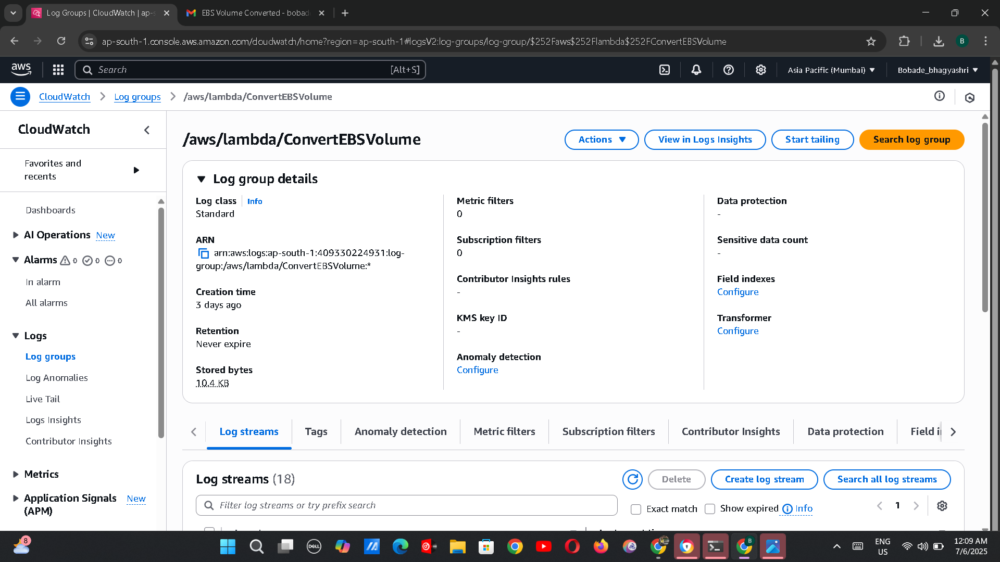
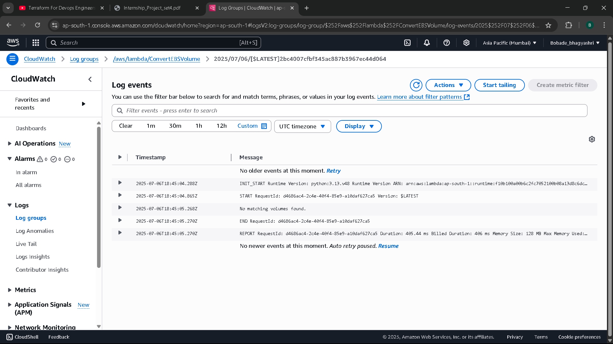

# 📦 Intelligent EBS Volume Optimization Using Lambda, CloudWatch, SNS, DynamoDB & Step Functions

🏆 **Objective**
Build a serverless automation pipeline that intelligently monitors EBS volumes,
identifies gp2 volumes, and converts them to gp3, with full logging, alerting, and audit
trail. This project reinforces knowledge of event-driven architecture, monitoring,
notifications, data logging, and state orchestration.

📢 **Why & Where to Use This Project?**

> 🏆 **Why Important?**
> - 📉 **Cut EBS Costs**: gp3 is ~20% cheaper than gp2. This project automates converting legacy gp2 volumes to gp3.
> - 🔄 **Zero Downtime**: Safe, automated process with full audit logs in DynamoDB.
> - 📧 **Proactive Alerts**: Admins get instant notifications of conversions or errors.
> - ☁️ **Serverless & Scalable**: Uses AWS-native services for reliability and scale.

> 🚀 **Where to Use (Real-World Examples)?**
> - **Enterprises with Hundreds of EC2 Instances** to optimize storage costs.
> - **Cloud Cost Optimization Teams** automating gp2→gp3 migration.
> - **SaaS Providers** hosting customer workloads on AWS.
> - **Disaster Recovery Environments** to keep replicated volumes cost-efficient.
> - **DevOps Pipelines** enforcing gp3 as a standard.

💡 *Example*:  
An e-commerce company migrated 250 gp2 volumes to gp3 with this workflow, cutting EBS costs by 18% in one week without downtime.

---

## 🛠️ Setup: Preparing Your Environment

Before starting, ensure you have:  

- ✅ An **AWS Account**
- ✅ An **EC2 instance** running in your region
- ✅ At least one **gp2 volume** attached to your EC2 (so Lambda can find and convert it)
- ✅ AWS CLI configured (optional, for testing)

  ## 🖥️ Architecture Diagram

## 📦 Components Used

| Component        | Purpose                                        |
|------------------|------------------------------------------------|
| AWS Lambda       | Finds gp2 volumes and converts them to gp3     |
| Step Functions   | Orchestrates Lambda, DynamoDB, and SNS         |
| DynamoDB         | Logs all conversion actions for audit          |
| SNS              | Sends email notifications post conversion      |
| EventBridge      | Triggers Step Function daily                   |
| CloudWatch Logs  | Stores Lambda execution logs                   |

## 🚀 Step-by-Step Guide

### ✅ Step 1 Create EC2 Instance with gp2 Volume
1. Go to **EC2 → Launch Instance**
   - Name: `EBS-Test-Instance`
   - AMI: Amazon Linux 2
   - Instance Type: t2.micro
   - Key Pair: Create or use existing
   - Network: Allow SSH (port 22)  
2. Under **Storage:**
   - Volume Type: **gp2**
   - Size: 8 GiB (or your choice)
3. Launch the instance.
4. Verify the instance has a gp2 volume attached.  

📸 *Screenshot:*  

### 📦 (Optional) Create and Attach gp2 Volume
If your EC2 was created with gp3:  
1. Go to **EC2 → Volumes → Create Volume**
   - Type: **gp2**
   - Size: 8 GiB
   - Availability Zone: Same as your EC2
2. Attach it:
   - Select the volume → **Actions → Attach Volume**
   - Choose your EC2 instance

📸 *Screenshot:*  

  

---

### ✅ Step 2: Create IAM Role for Lambda
1. Go to AWS Console → **IAM → Roles → Create Role**
2. Select **AWS Service** → Choose **Lambda** → Next
3. Attach the following policies:
   - `AmazonEC2FullAccess`
   - `AmazonDynamoDBFullAccess`
   - `AmazonSNSFullAccess`
   - `CloudWatchLogsFullAccess`
4. Name it: `LambdaEBSConversionRole`
5. Click **Create Role**

📸 *Screenshot:*  

---

### ✅ Step 3: Create DynamoDB Table
1. Go to **DynamoDB → Tables → Create Table**
2. Table name: `EBSConversionLogs`
3. Partition key: `VolumeId` (String)
4. Keep other defaults → Click **Create**

📸 *Screenshot:*  

---

### ✅ Step 4: Create SNS Topic
1. Go to **SNS → Topics → Create Topic**
2. Type: Standard
3. Name: `EBSVolumeConverted`
4. Create a Subscription:
   - Protocol: Email
   - Endpoint: *Your Email*
5. Confirm the email subscription (check your inbox)

📸 *Screenshot:*  

---

### ✅ Step 5: Create Lambda Function
1. Go to **Lambda → Create Function**
2. Name: `ConvertEBSVolume`
3. Runtime: Python 3.9
4. Attach the IAM Role: `LambdaEBSConversionRole`
5. Paste the Python code from [lambda_function.py](lambda_function.py)
6. Click **Deploy**

📸 *Screenshot:*  

---

### ✅ Step 6: Create Step Function
1. Go to **Step Functions → Create State Machine**
2. Type: Standard
3. Name: `EBSConversionWorkflow`
4. Paste the JSON definition from [state_machine_definition.json](state_machine_definition.json)
5. Set the Lambda function ARN in the definition
6. Click **Create**

📸 *Screenshot:*  

---

### ✅ Step 7: Automate with EventBridge Scheduler
Trigger your workflow daily at **6:00 AM IST**.

📝 Short Instructions:
1. Go to **EventBridge → Scheduler → Create Schedule**
2. Name: `DailyEBSConversionTrigger`
3. Description: Triggers Step Function daily to convert gp2 → gp3
4. Schedule:
   - Cron: `cron(30 0 * * ? *)`
   - (6:00 AM IST = 00:30 UTC)
5. Target: Your Step Function ARN
6. Create schedule  

📸 *Screenshot:*  

### ✅ Step 8: Test the Workflow
1. Run a manual execution of the Step Function

2. Observe logs in:

 - **DynamoDB**

     
 - **SNS (Email Notification)**

- **Convert Volume gp2 to gp3**
     

- **CloudWatch Logs**

## 🔒 Security Best Practices
- IAM roles with least privilege
- No wildcard (`*`) permissions
- SNS subscriptions require confirmation
- CloudWatch logs encrypted

---

## 📧 Contact
For queries, collaboration, or to connect professionally:

🔗 [**LinkedIn: Bhagyashri Bobade**](https://www.linkedin.com/in/bhagyashribobade)

---

