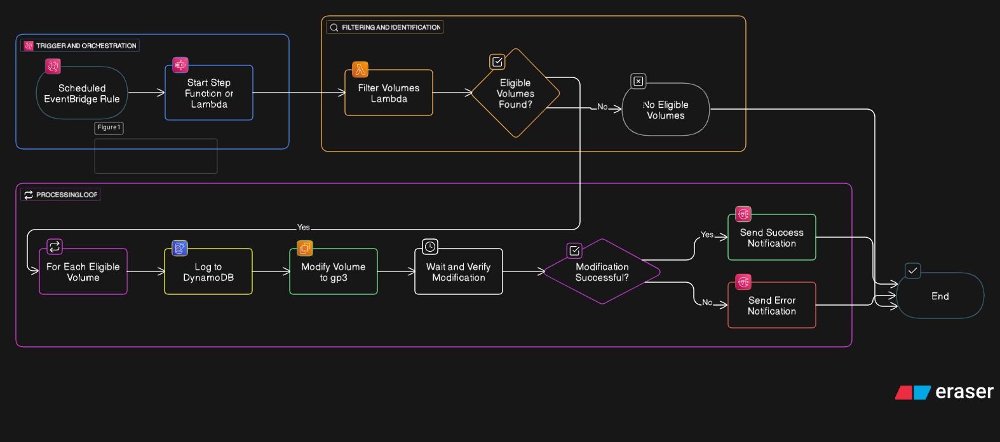
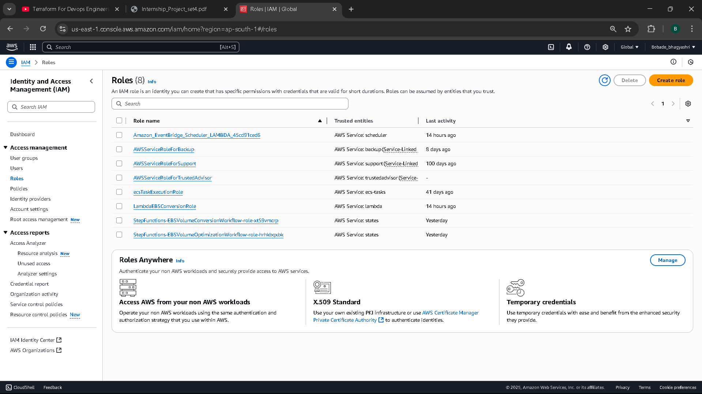
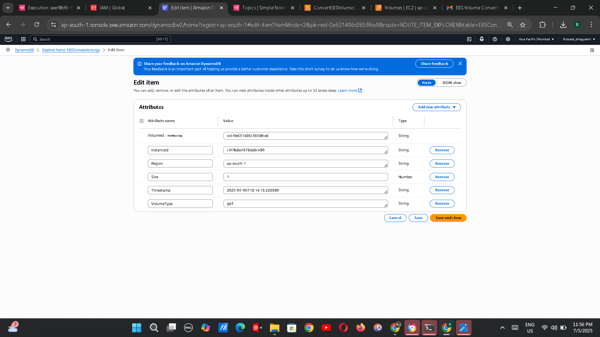
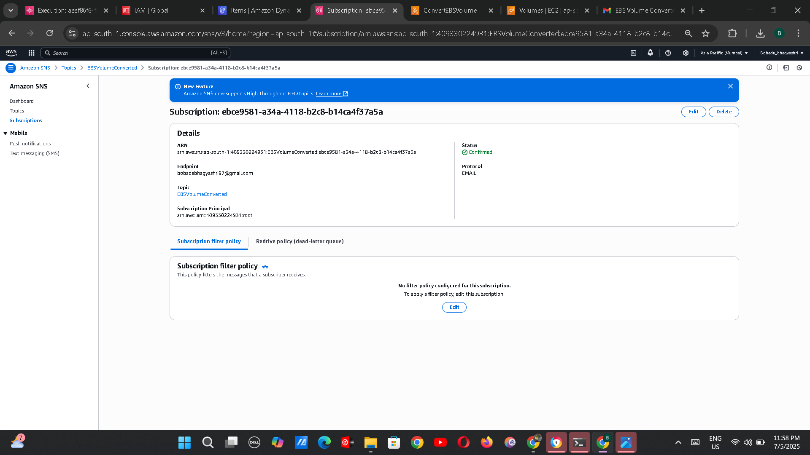
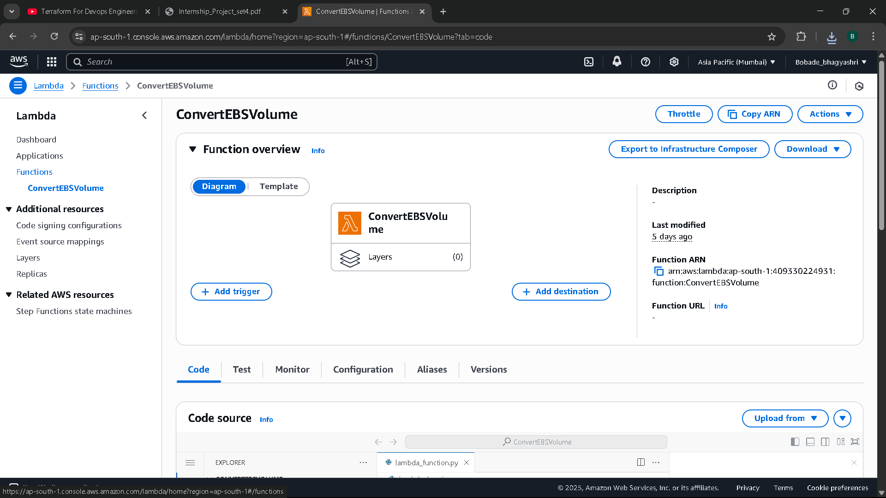
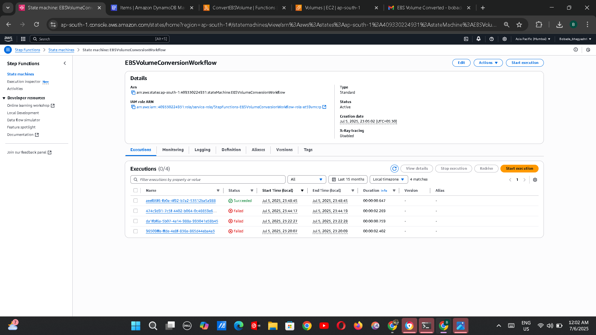

# 📦 Intelligent EBS Volume Optimization (AWS Lambda + Step Functions)

📢 **Why & Where to Use This Project?**

> 🏆 **Why Important?**
> - 📉 **Cut EBS Costs**: gp3 is ~20% cheaper than gp2. This project automates converting legacy gp2 volumes to gp3.
> - 🔄 **Zero Downtime**: Safe, automated process with full audit logs in DynamoDB.
> - 📧 **Proactive Alerts**: Admins get instant notifications of conversions or errors.
> - ☁️ **Serverless & Scalable**: Uses AWS-native services for reliability and scale.

> 🚀 **Where to Use (Real-World Examples)?**
> - **Enterprises with Hundreds of EC2 Instances** to optimize storage costs.
> - **Cloud Cost Optimization Teams** automating gp2→gp3 migration.
> - **SaaS Providers** hosting customer workloads on AWS.
> - **Disaster Recovery Environments** to keep replicated volumes cost-efficient.
> - **DevOps Pipelines** enforcing gp3 as a standard.

💡 *Example*:  
An e-commerce company migrated 250 gp2 volumes to gp3 with this workflow, cutting EBS costs by 18% in one week without downtime.

---

## 🌟 Features
- 🔄 Automatically identifies gp2 volumes tagged `AutoConvert=true`
- ⚡ Converts them to gp3 for cost savings
- 📝 Logs details in DynamoDB
- 📧 Sends notification emails using SNS
- ⏰ Daily scheduled automation with CloudWatch Events

---

## 🖥️ Architecture Diagram



---

## 🚀 Step-by-Step Guide

### 📌 Prerequisites
- AWS Account
- Basic understanding of EC2, Lambda, and IAM
- Configured AWS CLI (optional)

---

### ✅ Step 1: Create IAM Role for Lambda
1. Go to AWS Console → **IAM → Roles → Create Role**
2. Select **AWS Service** → Choose **Lambda** → Next
3. Attach the following policies:
   - `AmazonEC2FullAccess`
   - `AmazonDynamoDBFullAccess`
   - `AmazonSNSFullAccess`
   - `CloudWatchLogsFullAccess`
4. Name it: `LambdaEBSConversionRole`
5. Click **Create Role**

📸 *Screenshot:*  


---

### ✅ Step 2: Create DynamoDB Table
1. Go to **DynamoDB → Tables → Create Table**
2. Table name: `EBSConversionLogs`
3. Partition key: `VolumeId` (String)
4. Keep other defaults → Click **Create**

📸 *Screenshot:*  


---

### ✅ Step 3: Create SNS Topic
1. Go to **SNS → Topics → Create Topic**
2. Type: Standard
3. Name: `EBSVolumeConverted`
4. Create a Subscription:
   - Protocol: Email
   - Endpoint: *Your Email*
5. Confirm the email subscription (check your inbox)

📸 *Screenshot:*  


---

### ✅ Step 4: Create Lambda Function
1. Go to **Lambda → Create Function**
2. Name: `ConvertEBSVolume`
3. Runtime: Python 3.9
4. Attach the IAM Role: `LambdaEBSConversionRole`
5. Paste the Python code from [lambda_function.py](lambda_function.py)
6. Click **Deploy**

📸 *Screenshot:*  


---

### ✅ Step 5: Create Step Function
1. Go to **Step Functions → Create State Machine**
2. Type: Standard
3. Name: `EBSConversionWorkflow`
4. Paste the JSON definition from [state_machine_definition.json](state_machine_definition.json)
5. Set the Lambda function ARN in the definition
6. Click **Create**

📸 *Screenshot:*  


---

### ✅ Step 6: Test the Workflow
1. Run a manual execution of the Step Function
2. Observe logs in:
   - **DynamoDB**
   - **SNS (Email Notification)**
   - **CloudWatch Logs**

📸 *Screenshot:*  


---

### ✅ Step 7: Automate with CloudWatch
1. Go to **CloudWatch → Rules → Create Rule**
2. Trigger: Schedule Expression (cron: `0 6 * * ? *` → daily at 6 AM)
3. Target: Your Step Function
4. Click **Create Rule**

📸 *Screenshot:*  


---

## 📜 Deliverables
- ✅ Architecture Diagram
- ✅ Lambda Code ([lambda_function.py](lambda_function.py))
- ✅ Step Function Definition ([state_machine_definition.json](state_machine_definition.json))
- ✅ Screenshots
- ✅ Technical Report ([report.docx](report.docx))

---

## 🔒 Security Best Practices
- IAM roles with least privilege
- No wildcard (`*`) permissions
- SNS subscriptions require confirmation
- CloudWatch logs encrypted

---

## 📂 Folder Structure
```
.
├── lambda_function.py
├── state_machine_definition.json
├── report.docx
├── images/
│   ├── architecture.png
│   ├── iam-role.png
│   ├── dynamodb-table.png
│   ├── sns-topic.png
│   ├── lambda-function.png
│   ├── step-function.png
│   ├── step-function-execution.png
│   └── cloudwatch-rule.png
└── README.md
```

---

## 📧 Contact
For queries or collaboration, contact: [your-email@example.com](mailto:your-email@example.com)
